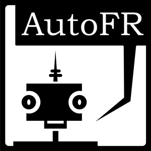

# Overview
AutoFR is a verbal free recall experiment that incorporates automatic speech-to-text processing by wrapping the [Google Cloud Speech API](https://cloud.google.com/speech).  We've implemented the experiment using [jsPsych](http://www.jspsych.org/) and [psiTurk](https://psiturk.org/) for easy deployment on [Amazon Mechanical Turk](https://www.mturk.com/mturk/welcome).  (You can also follow the instructions below to run the experiment locally.)  This code may be used "as is," or it may be used as a template to create your own variants of this experiment.

# Installing autoFR
+ Install [Docker](https://www.docker.com/) and [Google Chrome](https://www.google.com/chrome/browser/desktop/index.html)
+ Clone this repo: `git clone https://github.com/ContextLab/autoFR.git`
+ Set up Google Cloud Speech following [these](http://cdl-quail.readthedocs.io/en/latest/tutorial/speech_decoding.html#setting-up-the-google-speech-api) instructions. (see `exp/autoFR/google-credentials/credentials.json` for an empty template). Once you have a JSON formatted API keyfile downloaded, replace the empty template with it, renaming this new JSON to `credentials.json`.
+ Insert your `aws_access_key_id` and `aws_secret_access_key` in the file `exp/.psyturkconfig`. This file appears hidden, so you may have to change your file explorer's visibility settings to find and open it. You may also add your `psiturk_access_key_id` and `psiturk_secret_access_id` to this file, though it is not necessary to run the experiment locally.
+ Create an empty folder called `exp/audio`, which is where the participant data will be stored.

# Running autoFR
+ Run docker
+ Navigate to the cloned repo in terminal and type `docker-compose up -d` (this may take a little while)
+ Then, type: `docker attach autofr_psiturk_1`
+ Navigate to the experiment folder: `cd autoFR`
+ Type `psiturk`.  This should spin up a psiturk server
+ Then, type: `server on` (you may get an error the first time you try this, but try it again).
+ Then type `debug` <-this will initialize a local version of the experiment.
+ Point your Google Chrome browser to `localhost:22362` and follow the on-screen instructions to run in the experiment!

**IMPORTANT NOTE:** Make sure you have pop-up blockers turned OFF!!

# Analyzing the data
The audio data is stored in the folder `autoFR/audio`.  Each new subject's data is put in a folder with a unique name.  At the end of an experiment, the audio data is automatically shipped off to Google Speech, and a text file and response object will be saved out for each list.

We've created [Quail](http://cdl-quail.readthedocs.io/en/latest/), a Python toolbox for analyzing and plotting free recall data.  Detailed instructions may be found [here](http://cdl-quail.readthedocs.io/en/latest/tutorial.html); in summary, Quail relies on a data structure called an `egg`.  To create an `egg` object from the data you collect from this experiment (so that you can analyze it with Quail, make plots, etc.), follow the example code below:

```
import quail

# location of the database
dbpath = '~/exp/autoFR/participants.db'

# location of the audio files
recpath = '~/exp/autoFR/audio/'

# option to remove subjects
remove_subs = ['debugV2WLPQ:debugQN6O0V', 'debugFIGADU:debugPSS00O', 'debugZ5SE8F:debugYT96YP']

# experiment word pool
wordpool = '~/exp/autoFR/static/files/cut_wordpool.csv'

# experiment version (defined in autoFR/config.txt)
experiments = ['0.0', '1.0', '1.1', '6.1', '7.1', '8.1']

# optionally group experiments with different versions into a single egg
groupby = {'exp_version': [['0.0', '1.0', '1.1'], '6.1', '7.1', '8.1']}

# generate a list of `eggs` of len(groupby['exp_version'])
eggs = quail.load(dbpath=dbpath, recpath=recpath, remove_subs=remove_subs,
                  wordpool=wordpool, experiments=experiments, groupby=groupby)
```
